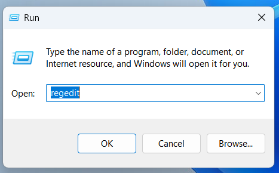
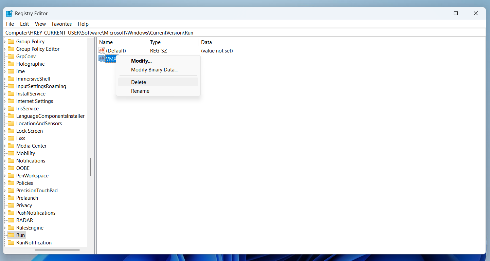

# Vmx
- Vmx is a simple lightweight C# Winforms app that allows the user to change the volume dirrectly from the dekstop
# Features
- The app by default is **click-through**, meaning that clicking on the app would do nothing , it will click whats under the app.
**Clicking CTRL will allow to click the app and change the volume.**
# Instalation
- Just simply go to the itch.io page and dowload from there : https://mateideveloper.itch.io/vmxvolumemxr
# How to stop the app from auto-starting when windows boots:
To stop the application from auto-starting when windows boots:
      -Press Win + R, and the run window will popup, then type regedit:
      
      -Then go to : **HKEY_CURRENT_USER\Software\Microsoft\Windows\CurrentVersion\Run**
      And delete the VMX entry:
      
